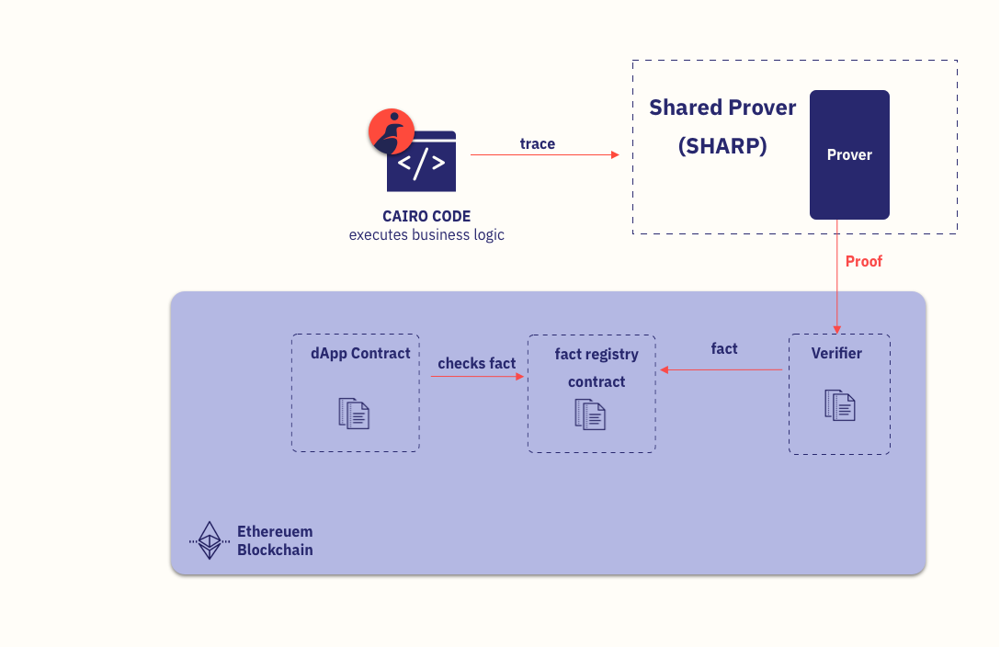

# Cairo introduction

## In a nutshell

You write your complex logic in Cairo, get it proved off-chain, and once that proof is validated on-chain, your smart contract application can use the result trustlessly – as if it executed that complex logic onchain, because that’s what the proof asserts.

## Components
The SHARP is the connecting link between your Cairo code and your Solidity smart contract. 
It has three main components:
    
- Prover (off-chain).

- FACT REGISTRY CONTRACT (on-chain).

- verifier smart contract (on-chain).

Sources:
- https://www.cairo-lang.org/cairo-for-blockchain-developers/#
- https://starknet.io/glossary/
- https://docs.starknet.io/